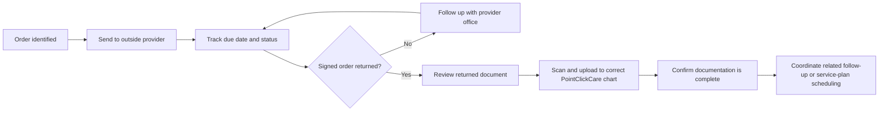

# Healthcare Provider-Order Workflow Case Study

> A privacy-safe workflow example based on administrative responsibilities I handled in assisted living and memory care. No resident, patient, or employer-confidential information is included.

## The workflow

One of my recurring responsibilities was helping keep physician orders and resident documentation moving between the community, outside medical providers, families, and the care team.

## What I was responsible for

- Communicating with outside medical providers by phone and fax.
- Sending physician orders and tracking them for completion.
- Following up when signatures or documents had not been returned.
- Monitoring incoming faxes and matching documents to the correct resident record.
- Uploading completed documentation into PointClickCare.
- Scheduling service-plan meetings and coordinating with families and care teams.
- Managing appointments and transportation when follow-up services were needed.
- Maintaining accurate demographic and insurance information used in resident support workflows.

## Skills this work demonstrates

**Healthcare operations:** keeping multi-step administrative processes moving without losing track of deadlines or documentation.

**Provider communication:** following up with outside offices clearly and professionally.

**Records management:** placing returned documentation in the correct PointClickCare chart and maintaining accurate records.

**Scheduling and coordination:** bringing together residents, families, care staff, transportation, and outside providers.

**Follow-through:** recognizing when a task was incomplete and continuing the process until the needed document or next step was received.

## Why I am documenting this on GitHub

I am learning how to use GitHub as a professional portfolio and as a place to document workflows, projects, and new technical skills. This case study translates a real healthcare-administration process into a clear, visual workflow while protecting private information.
